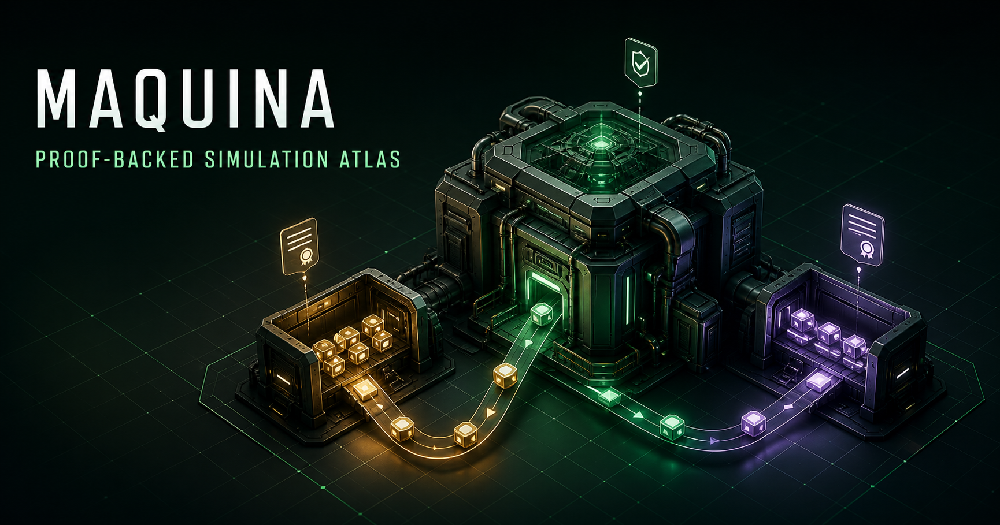
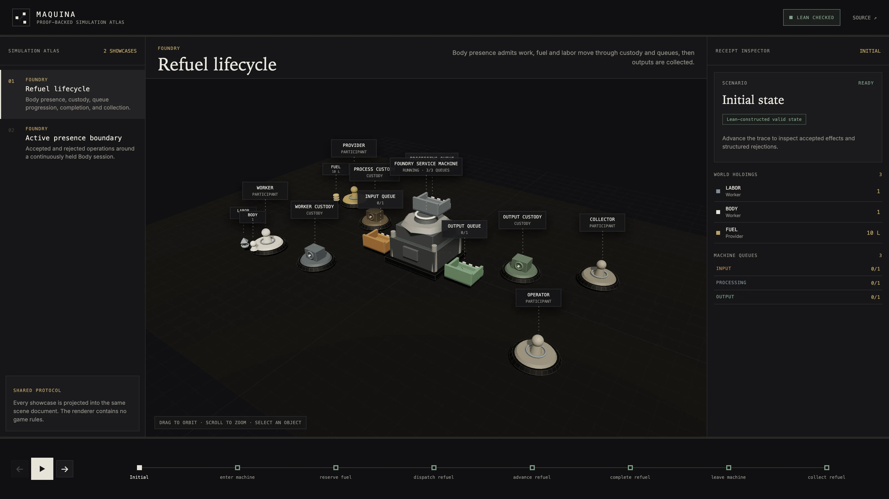
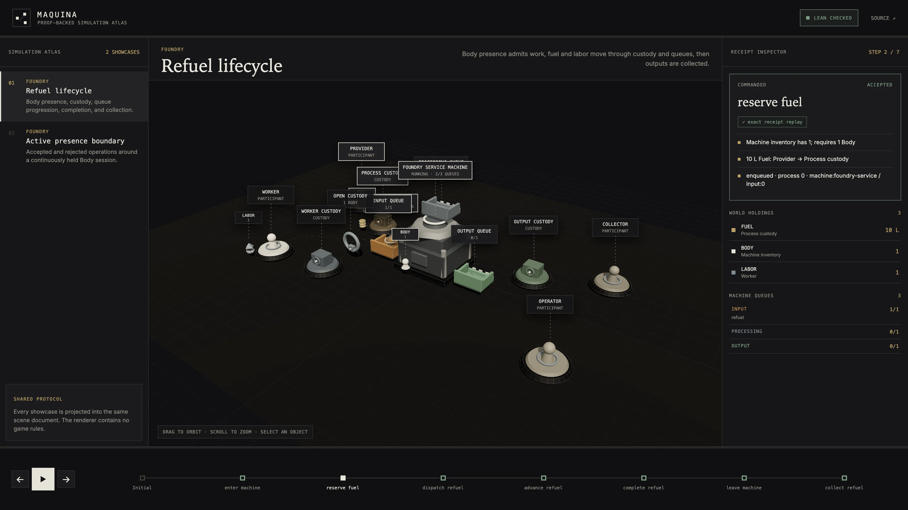
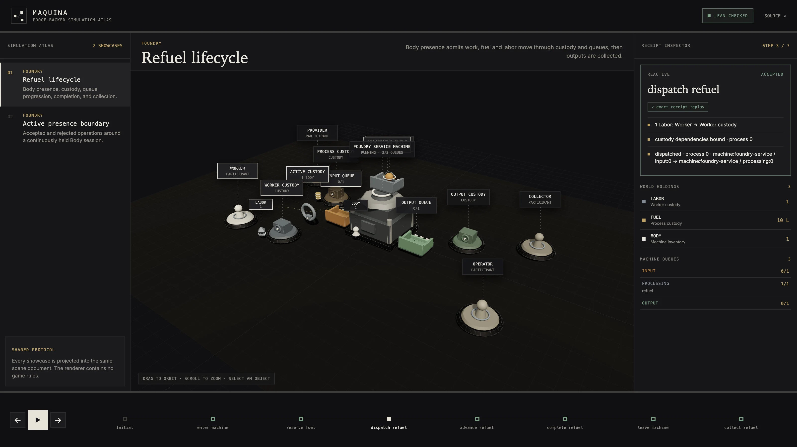

# Maquina

[](https://biomaai.github.io/maquina/)

*Explore the [proof-backed simulation atlas](https://biomaai.github.io/maquina/).*

Maquina is a formally specified execution model for deterministic, replayable
worlds. It describes what exists, where it belongs, which changes are allowed,
what each accepted change produces, and how the resulting history can be
reconstructed and verified.

The central boundary is simple:

> Agents, people, policies, planners, and solvers propose. Maquina determines
> what those proposals mean, whether they are valid, and what consequences
> they produce.

This repository is a conceptual foundation. It contains a proof-carrying Lean
4 semantic kernel, runnable downstream game simulations, and a catalog-driven
Three.js atlas of Lean-generated traces. No implementation has been copied from
earlier projects.

## Interactive visualizer

The [Maquina simulation atlas](https://biomaai.github.io/maquina/) presents
Lean-generated scenarios as interactive three-dimensional worlds. It is a
projection, never an alternative state-transition implementation:

[](https://biomaai.github.io/maquina/)

<table>
  <tr>
    <td width="50%"><a href="https://biomaai.github.io/maquina/?showcase=foundry-refuel-lifecycle"></a></td>
    <td width="50%"><a href="https://biomaai.github.io/maquina/?showcase=foundry-refuel-lifecycle"></a></td>
  </tr>
  <tr>
    <td><strong>Resource reservation.</strong> The receipt explains Body possession, fuel custody, and process enqueueing.</td>
    <td><strong>Queue transition.</strong> Active custody remains visible while the process moves into processing.</td>
  </tr>
</table>

Scene objects retain their identity across steps. Resources move only when a
receipt records a transfer, processes interpolate between queues, and machine
mechanisms animate only while their state justifies it. The inspector connects
every visible change to accepted effects or a structured rejection.

```text
Lean simulation -> versioned trace -> shared scene document -> Three.js
```

The Lean exporter owns exact state snapshots, accepted effects, structured
rejections, and replay provenance. Games provide only scenarios, vocabulary,
and declarative presentation. The scene projector and Three.js renderer contain
no Foundry or other game-specific rules.

Generate and validate the complete site with:

```sh
cd visualizer
pnpm install
pnpm check
```

See [`visualizer/README.md`](visualizer/README.md) for the shared protocol and
the steps required to register another game or scenario.

## Origin: digital twins as executable worlds

The project began with
[*Maquina: A Theory of Everything for Digital Twins*](https://x.com/rozgo/status/1983597308093567405),
an earlier vision for building digital twins from a small vocabulary of
Objects, Operations, and Machines. The article is conceptual history rather
than the current specification, but its central ideas still guide Maquina:

- a useful digital twin is an executable world, not merely a dashboard or
  static representation;
- computationally irreducible behavior must be explored by running the model,
  replaying it, and comparing possible histories rather than assuming every
  outcome has a shortcut;
- possible and impossible transformations should be stated explicitly, in the
  spirit of Constructor Theory; and
- humans, robots, LLMs, planners, and other agents should interact with one
  shared world model without becoming hidden sources of authority.

The vocabulary has become more precise as the formal model has developed:

| Earlier article | Current Maquina model |
| --- | --- |
| Objects | **Resources**: quantified, measured, unique, bounded, informational, or capability-bearing things. |
| Operations | **Operations and Processes**: state changes and resource transformations proposed against explicit requirements. |
| Machines | **Machines, inventories, custody, and typed queues**: stateful constructors that schedule and perform accepted transformations. |

Accounts locate resources; proposals bind abstract rules to a concrete world;
receipts and events make consequences inspectable and replayable. LLMs can help
people describe worlds and propose actions in natural language, but the
semantic kernel—not the LLM—decides what is valid and what happens next.

## Conceptual lineage

Maquina consolidates ideas explored independently across three repositories.
This is conceptual lineage, not a code merge.

| Source | Contribution to the concept |
| --- | --- |
| [`rozgo/maquina`](https://github.com/rozgo/maquina) | Typed resources, inventories, event sourcing, replayed projections, knowledge access, and MCP tools for agent interaction. |
| [`rozgo/maquina-bevy`](https://github.com/rozgo/maquina-bevy) | Composable resources, queues, universal machines, operations, processes, behavior trees, deterministic time, and simulation through Bevy ECS. |
| [`BiomaAI/axionomy`](https://github.com/BiomaAI/axionomy) | Closed authoritative state, assets and accounts, rates and exchanges, explicit invariants, structured rejection, exact forks, solver-neutral search, and verified replay. |

The new Maquina keeps the common thesis while remaining independent of the
existing implementations, storage systems, interfaces, and frameworks.

## What Maquina is

Maquina is a semantic kernel for systems whose state and changes must be
explicit, inspectable, and reproducible. The same model should be usable for:

- operational software;
- industrial and logistics systems;
- games and persistent simulated worlds;
- planning, optimization, and counterfactual exploration;
- human, robotic, and AI-agent coordination;
- auditable automation and formally checked execution.

Maquina is not an agent framework or a solver. It is the authoritative
environment those systems act against. An agent can propose an action, a
planner can explore a fork, and an optimizer can rank alternatives, but none
of them can make an invalid transition valid or mutate authoritative state
through a side channel.

## Core model

The vocabulary will be refined in Lean before the Rust runtime is designed,
but the initial model has the following roles.

### Resources

A resource identifies anything that can exist or matter: a physical material,
a unique artifact, a fact, a capability, a permission, a condition, a goal, an
observation, or a state token. Quantities may be discrete, measured, unique,
or composed, while preserving exact identity and units.

### Accounts and inventories

An account answers "where?" or "currently held by whom?" It can represent a
person, agent, machine, location, organization, scope, or namespace. An
inventory is a useful view of the resources held by an account; it is not a
separate source of truth.
Persistent ownership is not inferred from custody: return provenance is
recorded by accepted reservations, while transferable rights may themselves be
resources.

At its simplest, authoritative state can be understood as:

```text
State : Account x Resource -> Quantity
```

### Rules, rates, operations, and processes

A rule defines an allowed kind of change. It can declare:

- required and preserved conditions;
- consumed inputs;
- produced outputs;
- actor and account bindings;
- capabilities and permissions;
- capacity, timing, ordering, and uniqueness constraints;
- invariants that must remain true.

An operation changes the condition of a machine or actor. A process transforms
inputs into outputs. Both are specializations of explicit transition rules,
not permission to run arbitrary hidden mutation.

### Proposals, exchanges, and events

A proposal binds a rule to concrete actors, accounts, resources, quantities,
and parameters. Assessment is pure: it either returns a structured explanation
of why the proposal cannot apply or a complete description of its effects.

Applying an accepted proposal atomically produces a receipt and an immutable
event. The event history can reconstruct the same state through replay.

```text
proposal -> assess -> reject(reason)
                   -> accept(effects) -> apply -> receipt + event
```

### Machines and queues

A machine is a stateful processor governed by rules. It may have an inventory,
accept work through ordered queues, run one or more processing slots, consume
and produce resources, expose operating conditions, and record its evolution.

Queues make ordering, capacity, ownership, cancellation, and collection
explicit. Time is supplied by the environment so tests and simulations remain
deterministic.

### Agents and behaviors

Agents observe the portion of state they are permitted to see and propose
actions through the same transition boundary as every other participant.
Behavior trees, LLMs, policies, planners, scripts, and human interfaces are
replaceable decision systems outside the authoritative kernel.

### Projections, observations, and knowledge

Indexes, projections, graphs, dashboards, search structures, embeddings, and
knowledge views are derived from authoritative state and events. They may help
participants understand the world or choose a proposal, but rebuilding or
losing a projection cannot change what is valid.

## Current Lean foundation

The checked Lean implementation currently provides:

- exact discrete, measured, unique, and bounded-edition resources;
- canonical account holdings with known-resource and global-supply invariants;
- funded atomic transfers with structured shortfalls, conservation theorems,
  receipts, and exact holding replay;
- checked debit/credit transformation programs with all-or-none execution and
  exact replay;
- capacity-bounded FIFO queues with ordered, unique, monotonic tickets;
- direction-typed machine queues, a machine-wide queue maximum, and monotonic
  queue identities;
- declarative processes with proof-complete consumed inputs, temporary
  reservations, active-custody requirements, work, canonical outputs, account
  bindings, and receipt-derived provenance;
- state-indexed, non-consuming possession requirements checked before
  operation effects;
- receipt-backed machine custody with aggregate balance locks, exact return
  sources, monotonic custody positions, and proof-backed active-work
  dependencies that prevent premature exit;
- a generic declarative operation interpreter with structured rejection and no
  game-specific transition helpers;
- universal completion and allocation-delivery contracts with exact receipt
  coverage, unrelated-balance preservation, and non-reusable collected queue
  tickets;
- atomic queued and active cancellation with declared return-or-consume input
  disposition;
- partial output collection with proof-carrying remaining allocations and
  non-recurring collected labels;
- first-class positive-lot rates and atomic multi-account exchanges with
  indexed shortfalls, conservation, exact receipts, replay, reversal, and
  custody-lock-aware execution;
- accepted operation traces carrying a proof that deterministic semantic
  replay reaches their exact final simulator state;
- proposal-free direct effect receipts that reconstruct holdings by receipt
  fold and apply exact machine, queue, custody, mode, and counter patches; and
- a Foundry game proving admission-time Body presence, queued versus active
  Body-session behavior, queued versus active Labor, one-time collection,
  queue drainage, custody return, and one-job/two-job replay scenarios.

The proof inventory is summarized in
[`docs/lean-lifecycle-plan.md`](docs/lean-lifecycle-plan.md). Semantics that
remain unimplemented or insufficiently general are tracked explicitly in
[`docs/lean-proof-todo.md`](docs/lean-proof-todo.md).

Build and inspect the current reference behavior with:

```sh
lake build
lake exe foundry-demo
```

## What Maquina should eventually enable

When implemented, Maquina should be able to:

- define typed resources, capabilities, conditions, and units;
- place and transfer them across accounts, inventories, and locations;
- describe machines, workflows, queues, operations, and transformations as
  data;
- assess actions without mutation and explain every missing requirement;
- apply valid actions atomically and reject invalid actions consistently;
- derive current views from an append-only history;
- snapshot, fork, simulate, compare, and replay possible futures;
- expose actor-scoped observations and valid-action information;
- support competing or cooperating actors with different objectives;
- integrate through APIs, events, and MCP without giving integrations direct
  mutation authority;
- verify foundational invariants against a formal specification.

## Rust and Lean

Maquina starts as two deliberately separate layers.

### Lean 4: semantic specification

Lean defines the meaning of Maquina before runtime concerns are introduced.
The formal model already covers the current resource/process/machine lifecycle
and should eventually extend it with:

- immutable events and event replay;
- authorization and actor-scoped observation;
- deterministic time, multiple machines, and concurrent intent resolution;
- declared goals and invariants.

The current checked foundation establishes substantial portions of the
original proof targets:

- valid constructed worlds preserve canonical holdings, known resources,
  bounded supply, and queue capacity;
- rejected transfer, transformation, and operation APIs expose no successor;
- accepted transfers satisfy funding and catalog preconditions;
- pure inventory programs are all-or-none;
- transfer, transformation-program, semantic operation, and proposal-free
  direct-effect replay reach their exact checked successors; and
- unique resources cannot simultaneously occupy two distinct accounts.

The remaining universal theorems and future semantic layers are intentionally
listed in the [Lean proof backlog](docs/lean-proof-todo.md), rather than being
implied as already complete.

Lean is the source of semantic truth, not the production runtime. The project
may later generate test vectors, executable reference behavior, or checked
artifacts that the Rust implementation must satisfy.

### Games

The [`games`](games/) directory contains formal game simulations built as
downstream users of Maquina. They give the semantic kernel concrete worlds to
execute and provide proof targets that are understandable as playable rules,
rather than isolated formal examples.

Each game owns its domain vocabulary and rules. Concepts such as `running`,
`broken`, `refuel`, `smelt`, or `repair` belong to a game, while Maquina
currently supplies generic resource, queue, process, operation, machine,
custody, possession, cancellation, partial collection, rate/exchange, and
semantic/direct replay behavior. Time remains on the proof backlog.

### Rust: executable kernel

Rust will eventually provide the production engine, persistence boundaries,
projection machinery, simulation APIs, and integration surfaces. The runtime
must implement the Lean-defined semantics and demonstrate parity through
shared fixtures and conformance tests.

The Rust workspace is intentionally empty today. No crate structure or
framework choice should harden before the vocabulary and transition contract
are precise.

## Architectural boundary

```text
people / agents / policies / planners / solvers
                       |
                       v
                proposed action
                       |
                       v
        +-------------------------------+
        |            MAQUINA            |
        | observe -> assess -> apply     |
        | state + rules + invariants     |
        +-------------------------------+
                       |
                       v
      receipt + event + new observation + trace
```

Decision systems may use snapshots and forks to reason before proposing a
change. Only Maquina applies changes to the authoritative state.

## Non-goals for this foundation

This repository does not yet choose or provide:

- code copied from any predecessor;
- a database or event-store implementation;
- an ECS, robotics stack, or production runtime deployment platform;
- an agent runtime, model provider, or training system;
- a universal ontology for every domain;
- compatibility guarantees with existing Maquina, Bioma, or Axionomy data.

Those decisions should follow the formal model rather than define it by
accident.

## Development sequence

1. Continue closing the explicit Lean proof backlog for the current lifecycle.
2. Add deterministic time, events, snapshots, and forks in proof-preserving
   slices.
3. Design a pure Rust kernel against the stable specification.
4. Establish cross-language conformance fixtures.
5. Add event persistence and derived projections.
6. Add optional adapters for APIs, MCP, simulation, ECS, and operational
   platforms.

## Repository layout

```text
Cargo.toml          Empty Rust workspace
rust-toolchain.toml Pinned Rust toolchain
lakefile.toml       Lean project definition
lean-toolchain      Pinned Lean 4 toolchain
lake-manifest.json  Reproducible Lake dependency manifest
lean/Maquina.lean   Public root module for the formal specification
lean/Maquina/       Formal model modules and proofs
games/foundry/       Downstream declarations, closed proofs, and runnable trace
docs/                Current proof inventory and explicit Lean proof backlog
README.md           Conceptual overview and current implementation status
.github/workflows/  Rust workspace and Lean build validation
```

The repository should remain concept-first until the relevant formal
vocabulary and proof backlog are stable enough to support each runtime slice.
